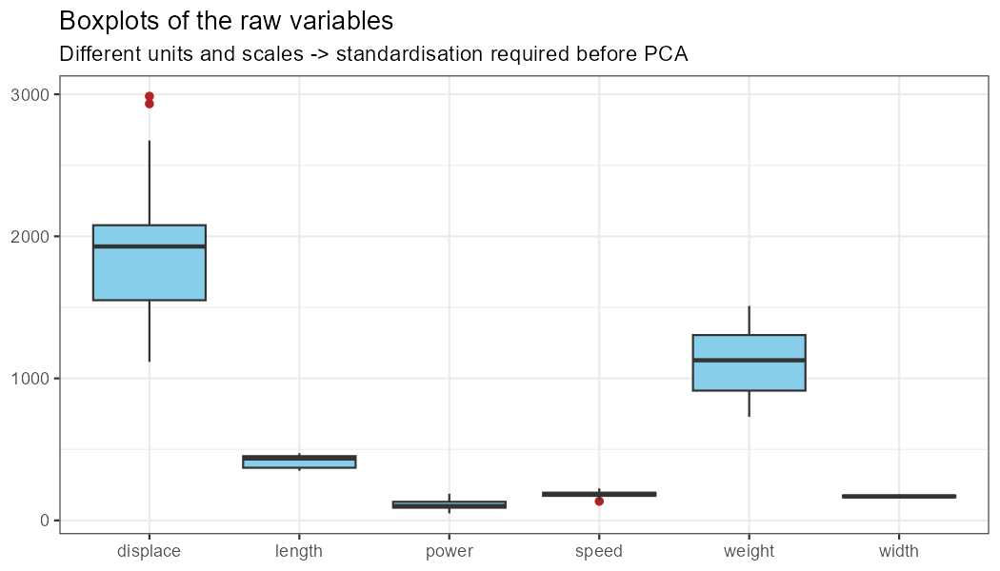

# Car Top Speed: Multicollinearity, PCA and Principal Component Regression

Course project — **Data Mining for Business**, NEOMA Business School.

A small end-to-end R case study built around a classic question:

> Can we predict a car's top speed from its technical characteristics, and can we trust the
> coefficients of the regression when those characteristics all measure the same thing?

The answer is developed in six steps: exploratory analysis → correlation heatmap → ordinary
multiple regression + VIF → discussion of the multicollinearity problem → PCA → principal
component regression → comparison of both models.

---

## Dataset

24 cars (mostly European models from the early 1990s), 6 numeric variables, no missing values.

| Variable | Description | Unit | Mean | SD | Min | Max |
|---|---|---|---|---|---|---|
| `displace` | Engine displacement | cm³ | 1 906.1 | 527.9 | 1 116 | 2 986 |
| `power` | Engine power | hp | 113.7 | 38.8 | 50 | 188 |
| `speed` | **Top speed (target)** | km/h | 183.1 | 25.2 | 135 | 226 |
| `weight` | Kerb weight | kg | 1 110.8 | 230.3 | 730 | 1 510 |
| `length` | Length | cm | 421.6 | 41.3 | 350 | 473 |
| `width` | Width | cm | 168.8 | 7.7 | 155 | 184 |

Source file: [`data/cars.csv`](data/cars.csv).

---

## Repository structure

```
.
├── data/cars.csv                    # raw dataset (24 rows)
├── run_all.R                        # runs the whole pipeline
├── scripts/
│   ├── 01_data_cleaning_eda.R       # step 0 — cleaning + EDA
│   ├── 02_correlation_heatmap.R     # step 1 — correlation heatmap
│   ├── 03_ols_regression_vif.R      # step 2/3 — OLS + VIF + discussion
│   ├── 04_pca.R                     # step 4 — PCA of the predictors
│   ├── 05_principal_component_regression.R   # step 5 — PCR
│   └── 06_model_comparison.R        # step 6 — model comparison
├── figures/                         # generated plots (git-ignored)
└── results/                         # generated CSV tables
```

## Requirements

```r
install.packages(c("tidyverse", "ggplot2", "corrplot", "car"))
```

R ≥ 4.0. Run everything from the repository root:

```bash
Rscript run_all.R
```

or `source("run_all.R")` in RStudio. Figures are written to `figures/`, numeric results to `results/`.

---

## Step 0 — Cleaning and exploratory analysis

* No missing values, no duplicated cars, all measurements strictly positive.
* The variables live on very different scales (displacement SD = 528 cm³ vs. width SD = 7.7 cm).
  → **standardisation is mandatory before any distance- or variance-based method** (PCA, clustering).
* Top speed is roughly symmetric, ranging from 135 to 226 km/h, with the BMW 530i, Rover 827i and
  Renault 25 forming a high-end cluster.



## Step 1 — Correlation heatmap

Pearson correlations (rounded):

| | displace | power | weight | length | width | speed |
|---|---|---|---|---|---|---|
| **displace** | 1.00 | 0.86 | 0.91 | 0.86 | 0.71 | **0.69** |
| **power** | 0.86 | 1.00 | 0.75 | 0.69 | 0.55 | **0.89** |
| **weight** | 0.91 | 0.75 | 1.00 | 0.92 | 0.79 | 0.49 |
| **length** | 0.86 | 0.69 | 0.92 | 1.00 | 0.86 | 0.53 |
| **width** | 0.71 | 0.55 | 0.79 | 0.86 | 1.00 | 0.36 |

**Every pair of predictors is positively correlated (0.55 – 0.92).** They are not five independent
pieces of information — they are five different ways of measuring the same latent idea:
"how big and how powerful is this car".

## Step 2 — Ordinary multiple regression and VIF

```
speed ~ displace + power + weight + length + width
```

| Term | Estimate | Std. error | t value | p value |
|---|---|---|---|---|
| (Intercept) | 137.226 | 52.913 | 2.593 | 0.018 |
| `displace` | 0.0042 | 0.0107 | 0.396 | 0.696 |
| `power` | 0.7353 | 0.0901 | 8.160 | 1.8e-07 |
| `weight` | **−0.0939** | 0.0229 | −4.096 | 0.0007 |
| `length` | 0.3779 | 0.1335 | 2.830 | 0.011 |
| `width` | −0.5972 | 0.4569 | −1.307 | 0.208 |

R² = **0.9148**, adjusted R² = 0.8911, F(5, 18) = 38.66 (p = 5.2e-09), residual SE = 8.32 km/h.

### VIF test — multicollinearity is confirmed

| Predictor | VIF |
|---|---|
| `displace` | **10.52** |
| `length` | **10.13** |
| `weight` | 9.26 |
| `width` | 4.06 |
| `power` | 4.06 |

Rule of thumb: VIF > 5 is worrying, VIF > 10 is severe. Two predictors exceed 10 and weight is
just below; `sqrt(VIF)` shows that the standard errors of `displace` and `length` are inflated by a
factor above 3.

## Step 3 — Why the coefficients cannot be interpreted

* `displace` correlates **+0.69** with speed, yet its coefficient is ≈ 0 and clearly not
  significant. Its explanatory power has been absorbed by `power`, `weight` and `length`.
* `weight` correlates **+0.49** with speed, yet its coefficient is **negative** (–0.094 km/h per kg).
  This sign reversal is the classic symptom of collinearity: a coefficient is estimated "holding the
  other predictors constant", and that comparison is meaningless when weight, length and
  displacement always move together.
* Fitted alone, every predictor has a positive slope — the negative weight coefficient only appears
  in the joint model.

**Conclusion:** the model is fine for *prediction*, but its coefficients must not be read as
"the effect of each variable on top speed".

## Step 4 — PCA: compressing redundant predictors

`prcomp(..., scale. = TRUE)` on the five standardised predictors. Scaling is essential here (cm³
vs. cm), otherwise the PCA would just be a PCA of displacement.

| Component | SD | Proportion of variance | Cumulative |
|---|---|---|---|
| PC1 | 2.043 | **83.4 %** | 83.4 % |
| PC2 | 0.721 | 10.4 % | 93.8 % |
| PC3 | 0.419 | 3.5 % | 97.3 % |
| PC4 | 0.261 | 1.4 % | 98.7 % |
| PC5 | 0.254 | 1.3 % | 100 % |

Loadings (variable → component):

| Variable | PC1 | PC2 | PC3 | PC4 | PC5 |
|---|---|---|---|---|---|
| displace | 0.466 | 0.281 | −0.245 | −0.034 | −0.802 |
| power | 0.411 | 0.683 | 0.507 | −0.034 | 0.325 |
| weight | 0.469 | −0.057 | −0.508 | 0.610 | 0.382 |
| length | 0.466 | −0.275 | −0.237 | −0.757 | 0.279 |
| width | 0.420 | −0.613 | 0.607 | 0.230 | −0.165 |

* **PC1 = "overall size / engine"** — all loadings positive and similar (~0.42 – 0.47).
* **PC2 = "power vs. width" contrast** — power (+0.68) against width (−0.61).
* The component scores are uncorrelated by construction (`cor(scores)` = identity), so
  multicollinearity has disappeared: **`VIF = 1`**.

> Note: the sign of a principal component is arbitrary (LAPACK-dependent). Only the relative signs
> *inside* a component carry meaning, so a component may come out with all signs flipped on another
> machine without changing anything else.

## Step 5 — Principal component regression

```
speed ~ PC1 + PC2          (93.8 % of the predictor variance)
```

| Term | Estimate | Std. error | t value | p value |
|---|---|---|---|---|
| (Intercept) | 183.083 | 2.744 | 66.73 | < 2e-16 |
| PC1 | 7.989 | 1.372 | 5.822 | 9.0e-06 |
| PC2 | 19.841 | 3.887 | 5.104 | 4.7e-05 |

R² = 0.7406, adjusted R² = 0.7159, F(2, 21) = 29.97 (p = 7.0e-07), residual SE = 13.44 km/h,
VIF = 1 for both components.

How many components to keep?

| Components | R² | Adj. R² | RMSE (km/h) |
|---|---|---|---|
| 1 | 0.4188 | 0.3923 | 18.82 |
| **2** | **0.7406** | **0.7159** | **12.57** |
| 3 | 0.8341 | 0.8092 | 10.05 |
| 4 | 0.9129 | 0.8946 | 7.29 |
| 5 | 0.9148 | 0.8911 | 7.21 |

With all five components, PCR reproduces the OLS model exactly — no information is lost, but
nothing is gained either. Interestingly, PC2 is worth keeping despite explaining only 10.4 % of the
predictor variance: its correlation with speed (0.57) is almost as high as PC1's (0.65).

## Step 6 — Comparison and discussion

| | OLS (5 predictors) | PCR (PC1 + PC2) |
|---|---|---|
| R² | **0.9148** | 0.7406 |
| Adjusted R² | **0.8911** | 0.7159 |
| RMSE | **7.21 km/h** | 12.57 km/h |
| MAE | **5.59 km/h** | 10.85 km/h |
| Max absolute error | **18.41 km/h** | 31.15 km/h |
| Max VIF | 10.52 | **1.00** |
| Parameters | 6 | **3** |

**Ordinary regression**

* Higher in-sample accuracy (RMSE 7.2 km/h) — it keeps all the raw information.
* Output stays in the original units (km/h per hp, per kg, …).
* But VIF up to 10.5: unstable coefficients, reversed signs, results sensitive to adding or
  removing a single car; 6 parameters estimated on 24 observations.

**Principal component regression**

* Orthogonal predictors (VIF = 1): numerically stable and unique estimates.
* Only 3 parameters: less variance, easier to generalise.
* Components are interpretable (size/power vs. power/width contrast).
* But a lower in-sample fit: PC1 + PC2 keep 93.8 % of the *predictor* variance yet explain only
  74 % of the *speed* variance — the 6 % of predictor variance that was dropped happened to matter
  for the target.
* Coefficients live in component space, not in "km/h per kg".

**Practical takeaway.** For pure predictive accuracy on this tiny sample, the OLS model (or PCR with
3–5 components) wins. For interpretation, stability and a parsimonious model, PCR is the better
choice — and if the goal is prediction *plus* stability, ridge/lasso regression is the natural next
step, since it shrinks coefficients without discarding any variable.

---

## Limitations

* 24 observations only: all metrics reported here are **in-sample**. A proper assessment would use
  cross-validation (e.g. leave-one-out), especially to choose the number of components.
* PCA is unsupervised: it maximises the variance of the predictors, not their relationship with
  `speed`. That is exactly why PC3 (3.5 % of predictor variance) still improves the fit notably.
* The data come from a single car market/era, so the model should not be extrapolated to modern
  vehicles.
